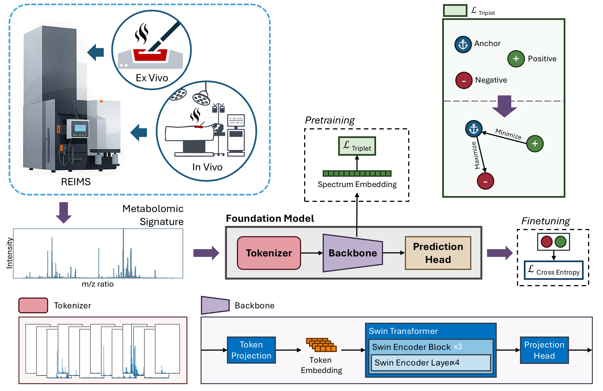

# FACT: Foundation model for Assessing Cancer Tissue margins



PyTorch implementation of [FACT: Foundation model for Assessing Cancer Tissue margins](#).

## Setup

Start by cloning the repository:

```bash
git clone https://github.com/med-i-lab/fact.git
```

and then installing PyTorch v2.3 in a new virtual environment. Follow the instructions on the [official website](https://pytorch.org/get-started/previous-versions/#v231) to install PyTorch.

Finally, navigate to the project directory and install the other dependencies:

```bash
pip install -r requirements.txt
```

## Pretraining

To pretrain the model, run the following command:

```bash
python train.py with Triplet base_model=laion/clap-htsat-unfused dataset=<PATH>
```

This will load in the configuration file, `configs/Triplet.yaml`, and start pretraining the model on the dataset located at `<PATH>`. The configuration file contains all the hyperparameters for the model, optimizer, and training loop. You can override the default values, e.g., the optimizer and learning rate, by passing them as arguments:

```
python train.py with Triplet base_model=laion/clap-htsat-unfused dataset=<PATH> optimizer=SGD lr=0.01
```

See `configs/defaults.yaml` for all the available hyperparameters.

To pretrain the model using multiple gpus, run the following command:

```
torchrun --nnode=1 --nproc_per_node=2 train-multiple-gpus.py with Triplet base_model=laion/clap-htsat-unfused checkpoints_dir=<PATH> dataset=<PATH>
```
### Backbones

We used two backbones for pretraining: `laion/clap-htsat-unfused` and `pluskal-lab/DreaMS`. You can specify the backbone by passing the `base_model` argument. For CLIP, you also need to specify `transform` (and `transform_params`). To simplify the process, we have provided an additional configuration file, `configs/CLIP.yaml`, that contains the default values for CLIP:

```
python train.py with Triplet CLIP dataset=<PATH>
```

### Ablation Studies

The configuration files for FixMatch and SimCLR are also available in the `configs` directory. We only used SimCLR in DESI application of FACT.

## Finetuning

To finetune the model, run the following command:

```bash
python train.py with base_model=laion/clap-htsat-unfused dataset=<PATH> checkpoint=<CHECKPOINT>
```

Note that you do not need to specify the `Triplet` configuration since the model has already been pretrained. Instead, you need to reference the final (or best) checkpoint file from the pretraining step.

To finetune the model, in a multiclass setting, run the following command:

```
python train.py with base_model=laion/clap-htsat-unfused dataset=<PATH> checkpoint=<CHECKPOINT> evaluator=MultiClassClassification prediction_head=[128, 6]
```

Note that the second value of the prediction head should be the number of classes in your dataset.

## Evaluation

Model checkpoints (all 30 finetuning runs, and top 10 pretraining runs) are available at `/mnt/mirage/med-i_data/Data/checkpoints/FACT_IPCAI2025`. To reproduce the results of the paper, run the following command:

```bash
python train.py with base_model=laion/clap-htsat-unfused dataset=<PATH> checkpoint=<CHECKPOINT> eval_only=True
````

## Specs

With the default hyperparameters, the model should fit in the GPU memory. If you encounter any issues, consider reducing the batch size or using the train-multi-gpus.py script.

## Deployment 


## Citation

> TBD

```bibtex
TBD
```

