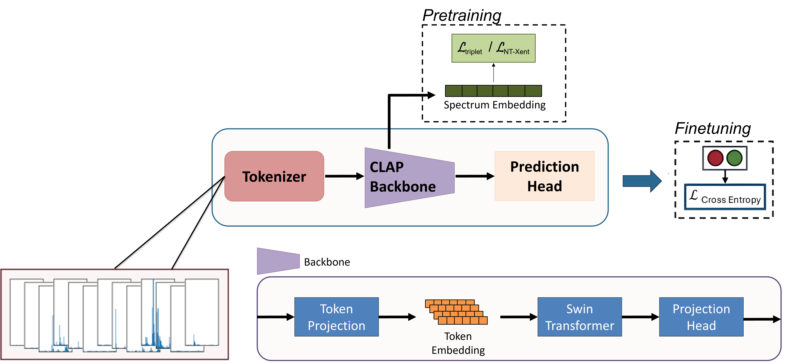
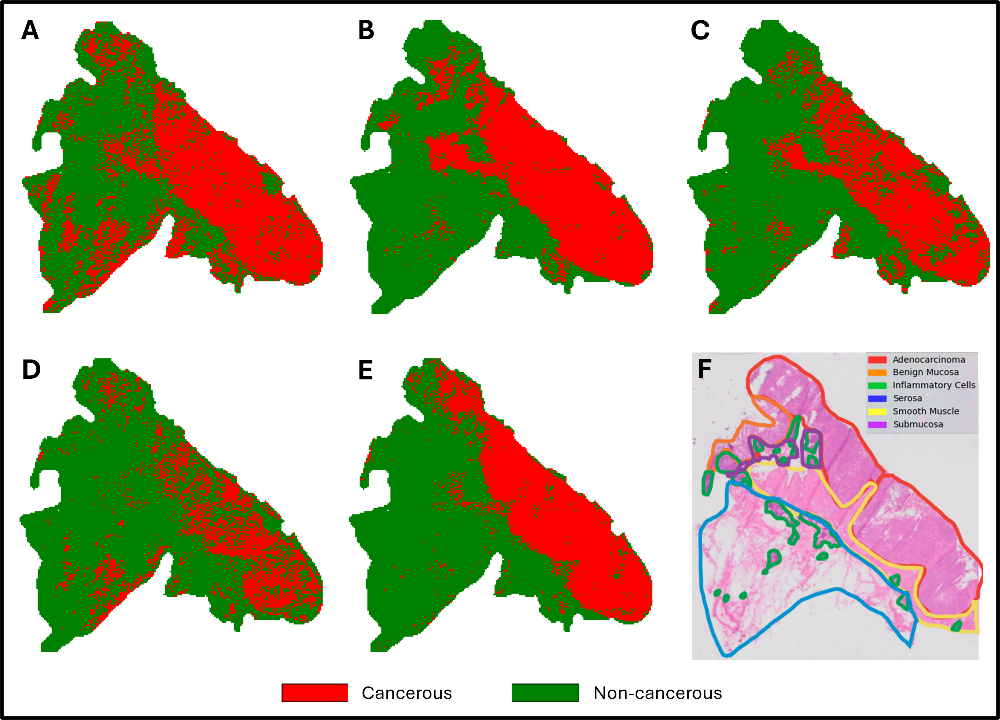

# Implementation of FACT on Desorption ElectroSpray Ionization Mass Spectrometry Imaging (DESI-MSI) Data



PyTorch implementation of [FACT: Foundation model for Assessing Cancer Tissue margins](#).

## Setup

Start by cloning the repository:

```bash
git clone https://github.com/AlonGabriel/fact.git
```

and then installing PyTorch v2.3 in a new virtual environment. Follow the instructions on the [official website](https://pytorch.org/get-started/previous-versions/#v231) to install PyTorch.

Finally, navigate to the project directory and install the other dependencies:

```bash
pip install -r requirements.txt
```

## Pretraining

To pretrain the model, run the following command:

```bash
python train.py with Triplet base_model=laion/clap-htsat-unfused dataset=<PATH> checkpoints_dir=<SAVE_PATH>
```

This will load in the configuration file, `configs/Triplet.yaml`, and start pretraining the model on the dataset located at `<PATH>`. The configuration file contains all the hyperparameters for the model, optimizer, and training loop. You can override the default values, e.g., the optimizer and learning rate, by passing them as arguments:

```
python train.py with Triplet base_model=laion/clap-htsat-unfused dataset=<PATH> checkpoints_dir=<SAVE_PATH> optimizer=SGD lr=0.01
```

See `configs/defaults.yaml` for all the available hyperparameters.

To pretrain the model using multiple gpus, run the following command:

```
torchrun --nnode=1 --nproc_per_node=2 train-multiple-gpus.py with Triplet base_model=laion/clap-htsat-unfused checkpoints_dir=<PATH> dataset=<PATH>
```
### Backbones

We used two backbones for pretraining: `laion/clap-htsat-unfused` and `pluskal-lab/DreaMS`. You can specify the backbone by passing the `base_model` argument.

### Ablation Studies

The configuration files for FixMatch and SimCLR are also available in the `configs` directory. We only used SimCLR in DESI application of FACT.

## Finetuning

To finetune the model, run the following command:

```bash
python train.py with base_model=laion/clap-htsat-unfused dataset=<PATH> checkpoint=<CHECKPOINT> checkpoints_dir=<SAVE_PATH>
```

Note that you do not need to specify the `Triplet` configuration since the model has already been pretrained. Instead, you need to reference the final (or best) checkpoint file from the pretraining step.

To finetune the model, in a multiclass setting, run the following command:

```
python train.py with base_model=laion/clap-htsat-unfused dataset=<PATH> checkpoint=<CHECKPOINT> evaluator=MultiClassClassification prediction_head=[128, 6]
```

Note that the second value of the prediction head should be the number of classes in your dataset.

## Evaluation

Model checkpoints (all crossfold validation runs, and top pretraining runs) are available at `P:\data\Alon-DESI_FACT`. To reproduce the results of the paper, run the following command:

```bash
python train.py with base_model=laion/clap-htsat-unfused dataset=<PATH> checkpoint=<CHECKPOINT> checkpoints_dir=<SAVE_PATH> transform=MinMaxNormalize eval_only=True
````

## Specs

With the default hyperparameters, the model should fit in the GPU memory. If you encounter any issues, consider reducing the batch size or using the train-multi-gpus.py script.

## Deployment 


The deployment module will make pixel-wise predictions using the input model and reconstruct a corresponding segmentation map, as seen in A-E in the figure above. To deploy the model on a full DESI slide, run the following command:

```bash
python deployment.py --desi_data_path <PATH> --checkpoint <CHECKPOINT> --save_path <PATH> --mz_ref <PATH>
```

#### Required Flags:

--desi_data_path: Path to the DESI text file for input data <br />
--checkpoint: Path to the model checkpoint file to use to make predictions <br />
--save_path: Path to save the output segmentation map <br />
--mz_ref: Path to the reference file containing the m/z values used in model training <br />

#### Optional Flags:

--base_model: Base model name (Default: laion/clap-htsat-unfused) <br />
--normalize: Method for peak normalization (Options: MinMaxNormalize or SampleNormalize) <br />
--projection_head: Use projection head in model (bool, Default: True) <br />
--randome_init: Randomly initialize the model (bool, Default: False) <br />
--prediction_head: Prediction head dimensions ([int, int]) <br />
--mask_path: Path to segmentation mask for masked deployment <br />
--visualize_embeddings: Visualize embedding space (bool) <br />

If --visualize_embeddings True: <br />
--cluster: Cluster embeddings (bool) <br />
--dimension: Specific embedding dimension to visualize (int), if none computes based on summary metric <br />
--metric: Summary metric for the embeddings (Options: L2, mean, max, pca) <br />


## Citation

> TBD

```bibtex
TBD
```

